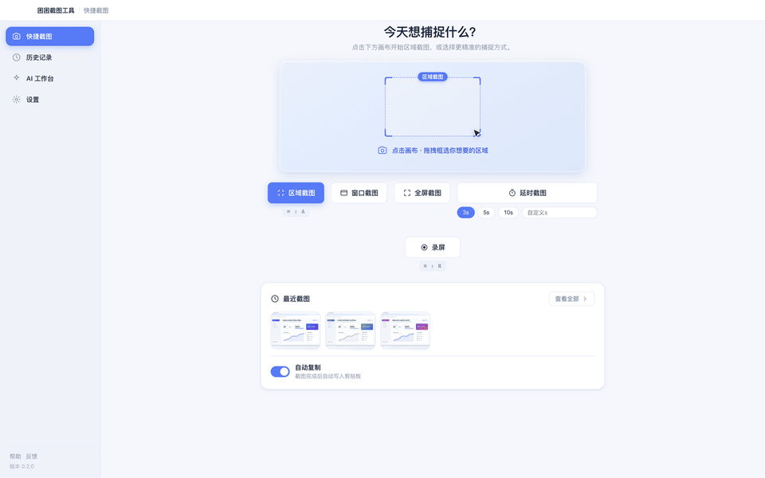
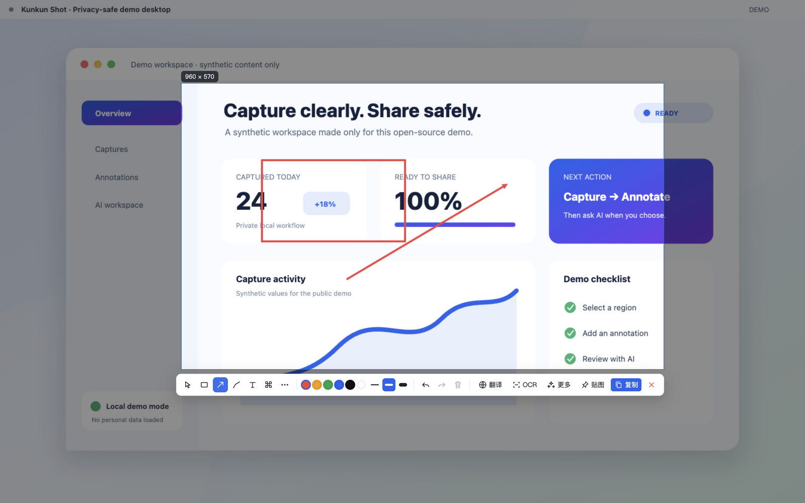
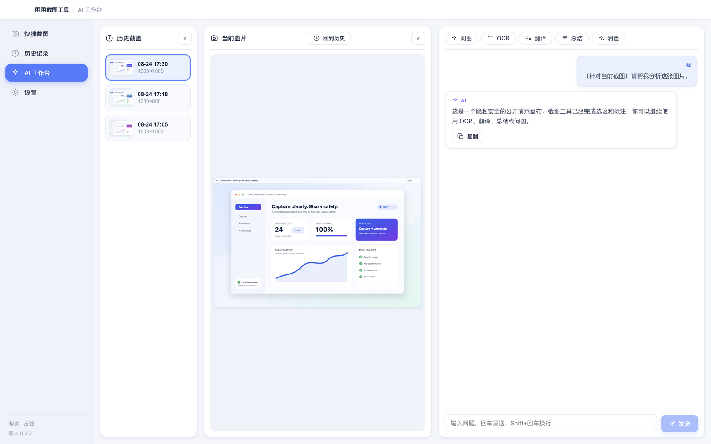

# Kunkun Shot

[简体中文](README.md) | English

An open-source, macOS-first Electron screenshot utility with capture and annotation, pinned reference windows, OCR, QR recognition, experimental scrolling capture, region recording with optional system/microphone audio, and optional AI-assisted image Q&A, translation, table recognition, and formula recognition.

> Status: early preview. Available source code and automated tests do not imply that every hands-on flow has passed acceptance. The project does not claim Windows/Linux support, nor does it claim that public builds are Apple-signed or notarized. See the [release checklist](docs/RELEASE_CHECKLIST.md) for the evidence required before a release.



> These assets come from the real Electron renderer running in an isolated session. The background, history items, and AI response are synthesized locally; no personal data or network request is used.

| Main window | Capture and annotation | AI workspace |
| --- | --- | --- |
|  |  |  |

## Capabilities

- Region, window, full-screen, and timed capture, including adjustable regions and multi-display selection.
- Rectangle, ellipse, arrow, line, pen, highlighter, polyline, text, mosaic, and numbered annotations with undo/redo.
- Pin images, text, colors, or Finder files to the desktop; pins support always-on-top, locking, mouse pass-through, thumbnails, and restoring the most recently closed item. Image pins can be annotated with pen, line, arrow, shapes, text, and eraser tools; the composite is used for copy, save, OCR, AI, and file drag-out. Open pins are saved on normal exit and restored as a local workspace.
- Local OCR using Tesseract.js and the repository's Chinese/English language data; macOS also has a system Vision-based text-box recognition path.
- QR recognition and copying from a selected region.
- Screenshot history is stored under `history/` in Electron's user-data directory. Automatic history capture is off by default, but a successful Save or Quick Save still stores another copy in history. Clearing history removes only those history copies, not files saved elsewhere by the user. History supports search, filters, copy, export, and bulk deletion.
- Screenshot export to PNG, JPEG, WebP, BMP, AVIF, or single-page PDF, with configurable default format and applicable quality.
- Region recording to WebM, or conversion through FFmpeg to H.264 MP4/GIF. System audio and microphone capture are independent opt-ins and are mixed when both are enabled; both remain off by default for backward compatibility.
- An AI workspace for OCR-assisted Q&A, translation, summarization, and rewriting, plus table recognition (Markdown/CSV) and formula recognition (LaTeX); a configured vision model can receive a selected image directly.
- A basic scrolling-capture flow. This remains experimental and can fail on complex pages.

## Quick start

Requirements:

- macOS (the current development and support focus)
- Node.js 22.12 or later
- npm
- Network access to npm and the `ffmpeg-static` binary source during the initial dependency installation

```bash
git clone https://github.com/duangjaiignacy-blip/kunkun-shot.git
cd kunkun-shot
npm ci
npm test
npm start
```

The main window opens by default and a menu-bar entry is also available. If a global shortcut is already owned by macOS or another app, change it in Settings.

### macOS screen and audio permissions

Capture, scrolling capture, and recording require **System Settings → Privacy & Security → Screen Recording**. A development run may appear as Electron or as the terminal that launched it.

1. Start the app and trigger a capture once.
2. Grant access to the relevant process in System Settings.
3. Fully quit Electron/the app, then run `npm start` again.

Without access, the app may capture only wallpaper, a black frame, or an empty image. Permission changes usually take effect only after a process restart.

System audio and microphone recording are off by default. The app asks for the corresponding macOS permission only after each source is enabled in Settings. If an explicitly requested source is denied or unavailable, recording fails clearly instead of silently producing a video without that audio. Both audio paths still require hands-on acceptance on the target macOS version and the actual signed artifact.

## Default shortcuts (macOS)

| Action | Shortcut |
| --- | --- |
| Region capture | `⌘ ⇧ A` |
| Capture and OCR | `⌘ ⇧ O` |
| Scrolling capture | `⌘ ⇧ L` |
| Region recording | `⌘ ⇧ R` |
| Pin clipboard content | `⌘ ⇧ P` |
| Restore the most recently closed pin | `⌘ 3` |
| Translate selected text | `⌘ ⇧ T` |

Global shortcuts are configurable. Single-key actions inside capture and pin windows have a separate settings group.

## Launch arguments (automation)

Development runs and packaged applications can enter the same controlled capture workflows through launch arguments. Development examples:

```bash
npm start -- --capture=region
npm start -- --capture=fullscreen --delay=5
npm start -- --capture=window
npm start -- --capture=ocr
```

`--capture` accepts `region`, `fullscreen`, `window`, `ocr`, `long`, or `record`. `--delay=1..300` can be combined only with `region` or `fullscreen`; a second launch of the single-instance app processes the arguments too. This is not a headless export API: capture still uses the graphical interface and requires the relevant macOS permissions. Duplicate, unknown, or out-of-range arguments fail explicitly.

## AI and data boundaries

AI is optional. Local capture, annotation, pinning, and local OCR do not require an API key.

Understand the data flow before enabling AI:

- Text tasks send prompts, user input, or locally recognized OCR text to the currently configured provider Base URL.
- Vision tasks send the screenshot explicitly selected by the user to a provider that accepts image input. In the current routing, MiniMax handles direct image input; text-only providers receive locally recognized text instead of the image.
- AI table/formula recognition follows the same boundary: the vision route sends the selected image, while a text-only route sends only local OCR text and may be unable to reconstruct a complex table reliably.
- “Auto” uses a fixed route: text-only tasks go only to DeepSeek and vision tasks go only to MiniMax, so both must be configured. If the provider required for a task is incomplete, the request stops with an explicit error and never switches to another provider using residual credentials.
- Connection tests and model-list requests also contact the configured endpoint.
- Local OCR reads only the repository/application `tessdata` resources; settings support `chi_sim+eng`, `chi_sim`, and `eng`. If required language data is missing, OCR fails explicitly and never falls back to a CDN or any other network download.
- API keys are persisted only after Electron `safeStorage` encrypts them successfully. If secure storage is unavailable or encryption fails, saving reports an explicit error—keys are never written as plaintext or falsely reported as saved.

Do not send screenshots containing personal data, trade secrets, or restricted third-party content to an untrusted model provider. Provider privacy, retention, and billing terms apply independently.

## Repository layout

```text
src/
├── main/       Electron main process: capture, config, history, OCR, media, and AI requests
├── preload/    contextBridge allowlisted API
├── renderer/   Framework-free HTML/CSS/JavaScript UI
└── shared/     IPC channels and default configuration
test/           Node regression tests
tessdata/       Local OCR language data
docs/           Product and release documentation
```

The renderer has no Node integration and communicates with the main process only through the `window.kkapi` preload bridge. There is no front-end bundling stage; Electron loads local HTML/CSS/JavaScript directly.

## Development and verification

```bash
npm test
npm audit --omit=dev
npm ls --depth=0
```

Regenerate the assets above with the real renderer and isolated local demo data:

```bash
env -u ELECTRON_RUN_AS_NODE ./node_modules/.bin/electron scripts/capture-demo.js
```

Automated tests cannot replace hands-on checks for screen permission, multiple displays, global shortcuts, OCR, recording, pin drag-and-drop, or Apple's distribution pipeline. Before publishing, complete [docs/RELEASE_CHECKLIST.md](docs/RELEASE_CHECKLIST.md) and attach actual evidence to the release notes.

`npm run dist:mac:local` (`dist:mac` remains a compatibility alias) creates an explicitly unsigned and unnotarized local test build. Only `npm run dist:mac:release` is the fail-closed formal signing/notarization path, and it verifies the resulting artifacts. See the [macOS release guide](docs/MACOS_RELEASE.md) for credentials, procedure, and hands-on evidence requirements. The repository currently provides pipeline and verification logic, not Apple credentials, signing/notarization records, or a verified formal artifact that could prove a release has been completed.

## Known limitations

- macOS is the only current support and acceptance focus. Generic Electron APIs in the source are not a cross-platform support commitment.
- Scrolling capture is experimental; complex scroll containers, dynamic content, and fixed elements may produce bad stitching.
- GIF conversion can be slow and storage-intensive, especially for long, high-resolution recordings.
- System audio, microphone capture, AVIF/PDF behavior in Preview/Finder, and cross-restart pin-workspace restoration still require acceptance on target macOS hardware.
- Global shortcuts may conflict with macOS or other applications.
- OCR accuracy depends on image quality, language data, and layout. AI output can also be wrong.
- Any unchecked automated or manual item in the release checklist remains unverified.

## Contributing and security

- Contribution guide: [CONTRIBUTING.md](CONTRIBUTING.md)
- Vulnerability reporting: [SECURITY.md](SECURITY.md)
- Release verification: [docs/RELEASE_CHECKLIST.md](docs/RELEASE_CHECKLIST.md)

Never paste API keys, access tokens, or unredacted personal data into a public issue, log, or demo capture.

## License

Original project source is available under the [MIT License](LICENSE), copyright © 2026 Kunkun / 困困.

Runtime distributions include third-party components under other licenses. In particular, the current lockfile resolves `ffmpeg-static` under GPL-3.0-or-later and it installs a platform-specific FFmpeg binary. MIT does not override those terms. Read [THIRD_PARTY_NOTICES.md](THIRD_PARTY_NOTICES.md) and satisfy every license obligation that applies to the exact source or binary artifact you distribute.
